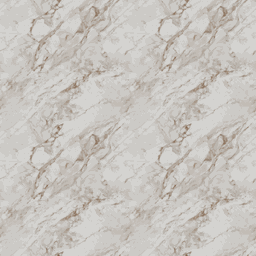

# Tiled Diffusion
<p style="font-style: italic;">
A novel approach for generating seamlessly tileable images using diffusion models.
</p>


> Or Madar, Ohad Fried  
> Reichman University  
>Image tiling—the seamless connection of disparate images to create a coherent visual field—is crucial for applications such as texture creation, video game asset development, and digital art. Traditionally, tiles have been constructed manually, a method that poses significant limitations in scalability and flexibility. Recent research has attempted to automate this process using generative models. However, current approaches primarily focus on tiling textures and manipulating models for single-image generation, without inherently supporting the creation of multiple interconnected tiles across diverse domains.
This paper presents Tiled Diffusion, a novel approach that extends the capabilities of diffusion models to accommodate the generation of cohesive tiling patterns across various domains of image synthesis that require tiling. Our method supports a wide range of tiling scenarios, from self-tiling to complex many-to-many connections, enabling seamless integration of multiple images.
Tiled Diffusion automates the tiling process, eliminating the need for manual intervention and enhancing creative possibilities in various applications, such as seamlessly tiling of existing images, tiled texture creation, and 360° synthesis.

<a href="https://arxiv.org/abs/2412.15185"></a>
<a href="https://madaror.github.io/tiled-diffusion.github.io/"></a>
<br/>

<p align="center">
  
</p>


## Installation
```bash
conda create -n td python==3.10
conda activate td
pip install --upgrade pip
pip install -r requirements.txt
```

## Quick Start
```python
import torch
import matplotlib.pyplot as plt
import numpy as np
from latent_class import LatentClass
from model import SDLatentTiling

model = SDLatentTiling()
device = 'cuda' if torch.cuda.is_available() else 'cpu'
prompt_1 = "Red brick texture"
prompt_2 = "Green brick texture"
negative_prompt = "blured, ugly, deformed, disfigured, poor details, bad anatomy, pixelized, bad order"
max_width = 32 # Context size (w)

# Many-to-many example on the X axis
lat1 = LatentClass(prompt=prompt_1, negative_prompt=negative_prompt, side_id=[1, 1, None, None],
                   side_dir=['cw', 'ccw', None, None])

lat2 = LatentClass(prompt=prompt_2, negative_prompt=negative_prompt, side_id=[1, 1, None, None],
                   side_dir=['cw', 'ccw', None, None])
latents_arr = [lat1, lat2]

new_latents_arr = model(latents_arr=latents_arr,
                        negative_prompt=negative_prompt,
                        max_width=max_width,
                        device=device)

lat1_new = new_latents_arr[0]
lat2_new = new_latents_arr[1]
t_1 = np.concatenate((lat1_new.image, lat2_new.image, lat2_new.image, lat1_new.image),
                     axis=1)

plt.imshow(t_1)
plt.show()
```

## Usage
```bash
python run.py
```
Under the file `run.py`, configure the latents using the class `LatentClass`, where `side_id` is a list of ids (i.e., the color patterns in the teaser for the constraints) and the `side_dir` is a list of orientations ('cw' or 'ccw' for clockwise or counter-clockwise). The list is always of size 4, with indexes corresponding to the sides (Right, Left, Up, Down). A simple example could be:

```python
side_id=[1, 1, None, None],
side_dir=['cw', 'ccw', None, None]
```

This means that the right and left sides should connect (the connection pattern must be from different orientations).
After the model finishes, the `LatentClass` will hold an attribute called `image` which is the result image of the diffusion process.
For ControlNet / Differential Diffusion / SD 3 / SD XL, please follow the corresponding directories (controlnet, diffdiff, sd3, sdxl) under the file name `example.py` (the same name under each directory).

## Examples
Here we provide declaration examples of self-tiling, one-to-one and many-to-many scenarios. We also include an example for img2img.

### Self-tiling


```python
lat1 = LatentClass(prompt=PROMPT, negative_prompt=NEGATIVE_PROMPT, side_id=[1, 1, 2, 2],
                   side_dir=['cw', 'ccw', 'cw', 'ccw'])
```
This example represents a self-tiling scenario where I<sub>1</sub> would seamlessly connect to itself on the X / Y axis.

### One-to-one


```python
lat1 = LatentClass(prompt=PROMPT1, negative_prompt=NEGATIVE_PROMPT1, side_id=[1, 2, None, None],
                   side_dir=['cw', 'ccw', None, None])
lat2 = LatentClass(prompt=PROMPT2, negative_prompt=NEGATIVE_PROMPT2, side_id=[2, 1, None, None],
                   side_dir=['cw', 'ccw', None, None])
```
This example represents a one-to-one scenario where I<sub>1</sub> and I<sub>2</sub> could connect to each other on the X axis.


### Many-to-many


```python
lat1 = LatentClass(prompt=PROMPT1, negative_prompt=NEGATIVE_PROMPT1, side_id=[1, 1, None, None],
                   side_dir=['cw', 'ccw', None, None])
lat2 = LatentClass(prompt=PROMPT2, negative_prompt=NEGATIVE_PROMPT2, side_id=[1, 1, None, None],
                   side_dir=['cw', 'ccw', None, None])
```
This example represents a many-to-many scenario where I<sub>1</sub> and I<sub>2</sub> could connect to each other and to themselves on the X axis.

### Img2img
Uncomment the img2img lines within the file `run.py`: 
```python
url = "https://raw.githubusercontent.com/CompVis/stable-diffusion/main/assets/stable-samples/img2img/sketch-mountains-input.jpg"
response = requests.get(url)
input_image = Image.open(BytesIO(response.content)).convert("RGB")
input_image = input_image.resize((768, 512))
lat1 = LatentClass(prompt=PROMPT, negative_prompt=NEGATIVE_PROMPT, side_id=[1, 1, None, None],
                   side_dir=['cw', 'ccw', None, None], source_image=input_image)
```
When adding the flag `source_image`, and attaching to it a PIL image, the code will automatically detect and encode it with the VAE to start with that representation in the latent space, instead of using random gaussian noise. 
The result would be a transformed tiled image on the X axis. (Notice this is a general img2img and not the application `Tiling Existing Images`. To use the application please refer the file `example.py` under the folder `diffdiff`)

## Creating Animated GIFs

<p align="center">
  
  
  
</p>
After generating tileable images, you can create seamless animated GIFs that demonstrate the tiling effect. We provide a utility script that can create animations in various directions (horizontal, vertical, and diagonal).
```python
from gif_creator import process_directory

# Process all images in a directory
process_directory(
    input_dir="path/to/generated/images",
    output_dir="path/to/output/gifs",
    direction="right",          # Choose: left, right, up, down, top_left, bottom_left, top_right, bottom_right
    duration=5000,             # Duration in milliseconds
    num_frames=30,             # Number of frames for smoothness
    target_size=512           # Resize images to reduce GIF file size
)
```
You can also use the command line interface:
```bash
python gif_creator.py input_folder output_folder right --target-size 512 --duration 5000 --frames 30
```

### Parameters
- `direction`: The direction of the animation (8 possible directions)
- `duration`: Total duration of the GIF in milliseconds
- `num_frames`: Number of frames in the animation (more frames = smoother animation)
- `target_size`: Target size for the longest dimension (to control file size)

### File Size Optimization
For HD images, it's recommended to use the `target_size` parameter to reduce the output GIF size:
- 512 pixels: Good balance of quality and file size
- 256 pixels: Very small file size
- 1024 pixels: Higher quality but larger file size

The script will maintain the aspect ratio while resizing.

## BibTeX
```bibtex
@misc{madar2024tileddiffusion,
      title={Tiled Diffusion}, 
      author={Or Madar and Ohad Fried},
      year={2024},
      eprint={2412.15185},
      archivePrefix={arXiv},
      primaryClass={cs.CV},
      url={https://arxiv.org/abs/2412.15185}, 
}
```
