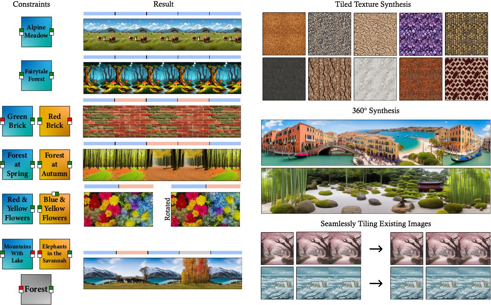

# Tiled Diffusion

<p align="center">
  
</p>

## Authors
Or Madar, Ohad Fried

Reichman University

## Links
- [Project Webpage](#) <!-- Add link when available -->
- [Paper](#) <!-- Add link when available -->
- [Supplementary Material](#) <!-- Add link when available -->


## Table of Contents
- [Abstract](#abstract)
- [Installation](#installation)
- [Usage](#usage)
- [Citation](#citation)

## Abstract
In digital image processing and generation, tiling—the seamless connection of disparate images to create a coherent visual field—is crucial for applications such as texture creation, video game asset development, and digital art. Traditionally, tiles have been constructed manually, a method that poses significant limitations in scalability and flexibility. Recent research has attempted to automate this process using generative models. However, current approaches primarily focus on tiling textures and manipulating models for single-image generation, without inherently supporting the creation of multiple interconnected tiles across diverse domains.

This paper presents Tiled Diffusion, a novel approach that extends the capabilities of diffusion models to accommodate the generation of cohesive tiling patterns across various domains of image synthesis that require tiling. Our method supports a wide range of tiling scenarios, from self-tiling to complex many-to-many connections, enabling seamless integration of multiple images.

Tiled Diffusion automates the tiling process, eliminating the need for manual intervention and enhancing creative possibilities in various applications. We demonstrate its effectiveness in three key areas: seamlessly tiling existing images, tiled texture creation, and 360° synthesis. These applications showcase the versatility and potential of our method in addressing complex tiling challenges across different domains of image generation and processing.

This is the official implementation of the paper Tiled Diffusion.


## Installation
```bash
conda create -n td python==3.10
conda activate td
pip install --upgrade pip
pip install -r requirements.txt
```

## Usage
Follow the script at `run.py`, which is easy to follow. This is for Stable Diffusion 1.5.
Under the file `run.py`, configure the latents using the class `LatentClass`, where `side_id` is a list of ids (i.e., the color patterns in the teaser for the constraints) and the `side_dir` is a list of orientations ('cw' or 'ccw' for clockwise or counter-clockwise). The list is always of size 4, with indexes corresponding to the sides (Right, Left, Up, Down). A simple example could be:

```python
side_id=[1, 1, None, None],
side_dir=['cw', 'ccw', None, None]
```

This means that the right and left sides should connect (the connection pattern must be from different orientations).
After the model finishes, the `LatentClass` will hold an attribute called `image` which is the result image of the diffusion process.
For ControlNet / Differential Diffusion / SD 3 / SD XL, please follow the corresponding directories (controlnet, diffdiff, sd3, sdxl) under the file name `example.py` (the same name under each directory).

## Citation
```bibtex
BIBTEX TO BE HERE
```
